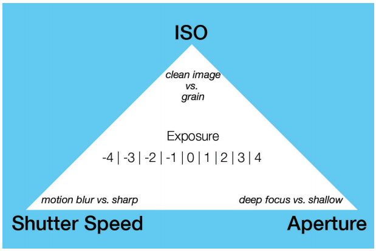

## Intro

Photography is all about balancing the three key elements: aperture, shutter speed, and ISO.

## Drop Auto - Understand Exposure

Exposure is how much of the light that is hitting your subject is entering your camera into the sensor.

###### Three things that control exposure:
1. Aperture (a.k.a F stop or IRIS)
  * Aperture is the space or the hole through which light passes into the sensor. It is also known as the F stop. The bigger the hole, the more light passes through and makes your images brighter and vice versa.
  * Wikipedia says: In optics, the f-number or the f-stop of an optical system is the ratio of the lens's focal length to the diameter of the entrance pupil.
  * One interesting thing is that the larger the F stop number goes, the smaller the aperture becomes. And the bigger the Aperture, the small the f stop. hmm... :D
  * **A wider aperture (f/1.4 - f/5.6) will have a shorter depth of field and have that blurry background (usually seen in high quality images), than a small aperture (f/16 - f/22).**

  

2. Shutter Speed
  * The shutter allows light to pass to the sensor.
  * The faster it opens and closes, the less light travels to the sensor.
  * Shutters can open and close at 1/8th of a second. 1/8th of a second might sound fast but it is actually very slow for a camera. A safe shutter speed for most condition would be around 1/100th of a second. However, depending on what you are trying to achieve, you can go slower or faster to get your perfect shot.
  * ** Shutter speed determines how sharp your picture is or how much motion blur it has. For example, a faster shutter speed (1/200 of a second) will be much sharper than a shutter speed (1/15 of a second). **

3. ISO
  * The ISO (International Standards Organization) determines the sensitivity of the sensor in your camera which, in turn, affects the exposure of you photos.
  * ISO is one of the three elements that affect exposure. It is very similar to the shutter speed. Just like shutter speed, the larger the ISO number, the more exposed your photo will be. Unlike Aperture, the ISO and shutter speed have a directly proportional relationship.
  * Your photos get grainy when the ISO gets larger in number. So, as a general rule, the lower the number, the better the quality of the photo. However, at night when it's extremely dark, bringing up the ISO might just be the key to getting a viewable photo despite the grain.
  * 1800 ISO means the sensor is more sensitive and you won't need as much light and 100 ISO means your camera sensor is less sensitive to light and therefore requiring more light. Today, some cameras can only go up to 3200 ISO and some can go up to 4000,000 ISO.
  * ** ISO affects how grainy or clear your photo will be. A high ISO (1800) will be much more sensitive to light and therefore a lot more granier than a low ISO (100). However, now with the advancement in the digital optical technology, there are cameras out there that can shoot up to 100,000 ISO and still have a relatively clear image. **

  #### 
 The Exposure Triangle

  Now that you understand the 3 key factors affecting exposure, you are ready to go out there and test your knowledge and be creative by rotating that dial to "M" (manual). Photography is all about controlling and balancing the above 3 factors to capture that perfect image, which is also known as "The Exposure Triangle".

  

  As shown in the image above, even though ISO, Shutter Speed and Aperture all affect exposure, there are key differences in how each affects light and how to leverage them depending on the situation.

  
